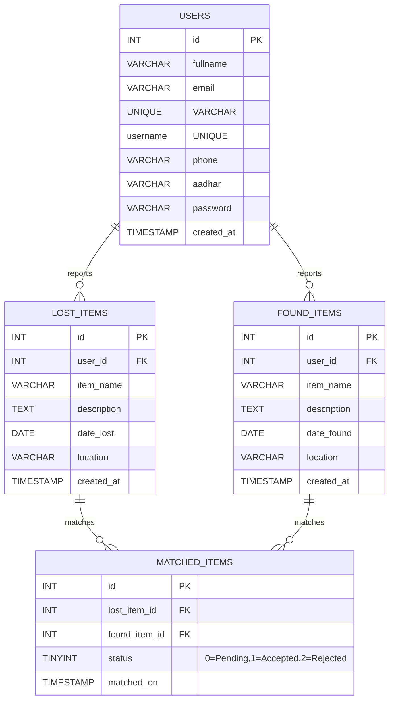

## Lost & Found System — Architecture Diagrams

### Notation Legend and Identifiers

- **External Entity (EE-xx)**: Actors at system boundaries
- **Process (P#)**: Rounded blocks representing transformations
- **Data Store (DS#)**: Logical stores (tables)
- **Data Flow (DF-xx)**: Labeled arrows A → B carrying data
- **Event (EVT-#)**: Triggers that initiate flows

Identifiers
- EE-01 User, EE-02 Admin, EE-03 Email/SMS Gateway
- P1 User Management, P2 Item Reporting, P3 Matching Engine, P4 Admin Review, P5 Notifications
- DS1 Users, DS2 Lost Items, DS3 Found Items, DS4 Matches, DS5 Audit Logs (logical)

---

### Level 0 — Context Diagram

```
EE-01 User ──DF-01/05/07──▶ [Lost & Found System] ◀──DF-19── EE-02 Admin
     ▲                                 │
     │                                 └──DF-17/18──▶ EE-03 Email/SMS
     └────── DF-04/notifications ────────────────────────────────┘

Conceptual Stores: DS1 Users, DS2 Lost Items, DS3 Found Items, DS4 Matches
```

---

### Level 1 — Top-Level Decomposition

```
          P1 User Mgmt        P2 Item Reporting        P3 Matching
              │                       │                     │
              ▼                       ▼                     ▼
           DS1 Users             DS2 Lost Items         DS4 Matches
                                  DS3 Found Items

                 ◀───────────── P4 Admin Review (DF-13) ─────────────▶
                                   │  (DF-14/15)
                                   ▼
                                 DS4 Updates

          P5 Notifications ──DF-16──▶ EE-03 Email/SMS, dashboards (DF-18)
```

Data Flows (primary): DF-01..DF-20 as defined below.

---

### Level 2 — Selected Process Expansions

P1: User Management
- DF-01: EE-01 → P1 (registration)
- DF-02: P1 → DS1 (create user)
- DF-03: EE-01 → P1 (login)
- DF-04: P1 → EE-01 (session/ack)

P2: Item Reporting
- DF-05: EE-01 → P2 (lost details)
- DF-06: P2 → DS2 (store lost)
- DF-07: EE-01 → P2 (found details)
- DF-08: P2 → DS3 (store found)
- DF-09: P2 → EE-01 (ack)

P3: Matching Engine
- DF-10: DS2 → P3 (new lost)
- DF-11: DS3 → P3 (new found)
- DF-12: P3 → DS4 (candidate matches, status=Pending)

P4: Admin Review
- DF-13: DS4(Pending) → P4
- DF-14: P4 → DS4 (status Accepted/Rejected)
- DF-15: P4 → DS5 (audit)

P5: Notifications
- DF-16: DS4 status change → P5
- DF-17: P5 → EE-03 (emails/SMS)
- DF-18: P5 → EE-01 (dashboards/contact sharing)

Admin Interaction
- DF-19: EE-02 ↔ P4 (decisions/filters)
- DF-20: EE-02 → P5 (broadcasts)

---

### Mermaid ER Diagram (derived from code and README schema)



---

### Data Flow Catalogue (DF-01..DF-20)

- DF-01: Registration data EE-01 → P1
- DF-02: Create account P1 → DS1
- DF-03: Login credentials EE-01 → P1
- DF-04: Session/ack P1 → EE-01
- DF-05: Lost details EE-01 → P2
- DF-06: Store lost P2 → DS2
- DF-07: Found details EE-01 → P2
- DF-08: Store found P2 → DS3
- DF-09: Acknowledgement P2 → EE-01
- DF-10: New lost DS2 → P3
- DF-11: New found DS3 → P3
- DF-12: Candidate matches P3 → DS4
- DF-13: Pending matches DS4 → P4
- DF-14: Status update P4 → DS4
- DF-15: Audit log P4 → DS5
- DF-16: Status change DS4 → P5
- DF-17: Notifications P5 → EE-03
- DF-18: Dashboard/contact P5 → EE-01
- DF-19: Admin decisions EE-02 ↔ P4
- DF-20: Broadcasts EE-02 → P5

---

### Notes

- Derived from `register.php`, `lost_item.php`, `found_item.php`, and README schema.
- If your live DB differs (extra columns/indexes), share the SQL dump to update ERD.


